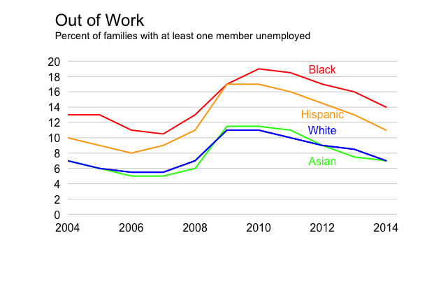
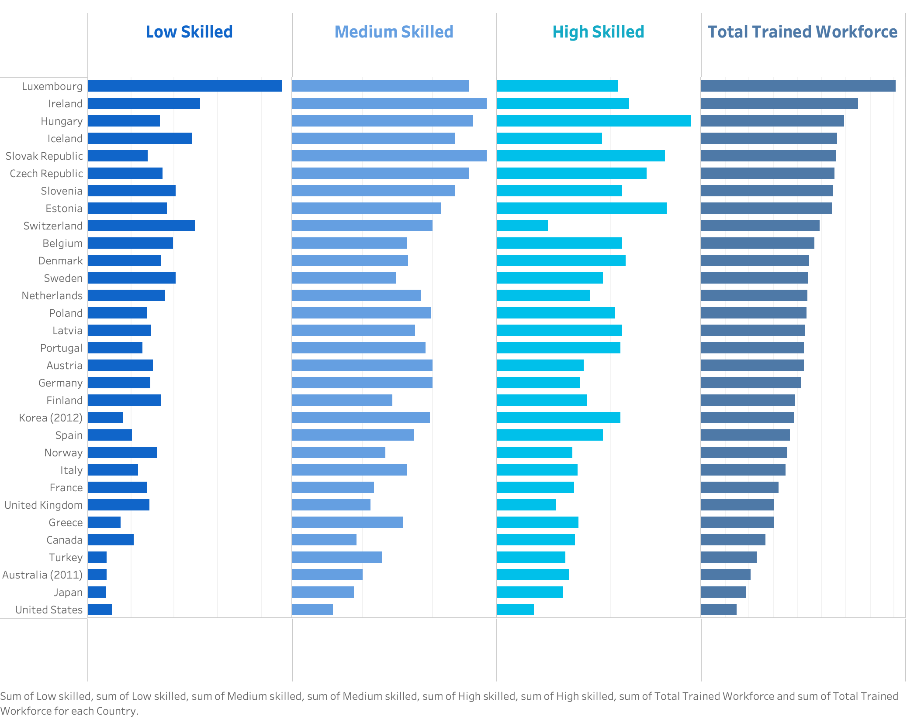

# Homework 3: Re-Create Charts
*CS 625, Fall 2021*

*Peter G. Mavronicolas*

*Due: Tuesday, October 5, 2021 by 11:59pm*

================

## Part 1: Choose one chart, can use Excel, Tableau, R, or Vega-Lite

**Re-creating the Line chart**

*Choice of Idiom:*

     I chose the Line Chart because the visualization of several groups over large periods of time allows the user to quickly compare one group from another.

*Download:*

     I downloaded the excel spreadsheet from the github repository by right-clicking my Apple mouse, selecting "Save Link as.." and saving the file to my Downloads folder.
    
*Import:* 

     In R Studio, I selected "Import Dataset", then selected the excel spreadsheet I previously downloaded.
    
*Cleaning the Data:* 
    
     I noticed that the Year column wasn't labeled correctly so I replaced the text with "Year".
    
*Creating the Chart:* 
    
     I created a script in R Studio using the plot() function to display the graph. Next, I added lines for each race in the data using points().
     
*Grid Lines:*

     To add the horizontal grid lines, I used the function axis(), set the line color to light grey and the line width to 2.
    
*Line Labels:* 

     In order to add labels to each line of data within the graph, I used the text() function. This function allowed me to place the text based on x,y coordinates.
    
*Title/Subtitle:* 

     To add the title and subtitle, I used the mtext() function.The size was adjusted to match the original line chart in the assignment.

## Part 2: Choose one chart, can use Tableau, R, or Vega-Lite (no Excel)

**Re-creating the Small Multiples Bar chart**

*Choice of Idiom:*

     I chose the Small Multiple Bar Chart because the visualization of large amounts of rows with multiple columns is best depicted using side-by-side, horizontal bar charts with differing colors. Doing so allows the user to quickly perform comparisons by Country for each level of skilled workers. 

*Download:*

     I downloaded the excel spreadsheet from the github repository by right-clicking my mouse, selecting "Save Link as.." and saving the file to my Downloads folder.
    
*Import:* 

     In the left column of Tableau Desktop, I selected "To a File", "Microsoft Excel" and checked the "Cleaned with Data Interpreter" box.
    
*Cleaning the Data:* 
    
     I then dragged the data file beginning with "JobsFinalDem_SkillIntensity" and renamed the column containing the country names and labeled it "Country".I also renamed the column "Total" to "Total Trained Workers".
    
*Creating the Chart:* 
    
     I dragged the data labeled "High Skilled", "Medium Skilled", "Low Skilled" and "Total Trained Workforce" (in that order) into the columns field. I dragged the data for "Country" into the rows field.
    
*Sort:* 
    
     I selected the "sort" button above "Total Trained Workforce" to sort descending. Doing so matched the Country order as shown in the homework example.
    
*Editing:* 

     I selected the x-axis title, right-clicked, "edit axis...", "tick marks", "major (and minor) tick marks" and selected none for tick marks of each column. I also dragged a duplicate column in the columns field, right-clicked "Dual axis", then right-clicked again and selected "Edit axis" and deleted the footer label for each column. Finally, I right-clicked on the heading for each column, navigated to "Marks" and selected "Bar". The graphs should return to its original Bars.
    
*Removing Labels:* 

     To remove a label such as "Country", I right-clicked on the "Country" label and selected "hide labels".
    
*Font:* 

     I selected the header I wished to edit, right-clicked, then "format". I then selected "font" in the left pane and changed the font size to 14 and matched the color to the bar data depicted in the column.
    
*Size:* 
     
     Finally, in the "Marks" pane with "Bar" selectd in the dropdown, I selected size and reduced the size of each bar to 75%.

    

## References

- Grid line consistent with ticks on axis,
    https://stackoverflow.com/questions/8081931/grid-line-consistent-with-ticks-on-axis
- Label lines in a plot
    https://stackoverflow.com/questions/4196964/label-lines-in-a-plot
- Removing borders in R plots for achieving Tufte's axis,
    https://stats.stackexchange.com/questions/4489/removing-borders-in-r-plots-for-achieving-tuftes-axis
- Moving Horizontal Bar Chart Headers from Bottom to Top,
    https://kb.tableau.com/articles/howto/moving-horizontal-bar-chart-headers-from-bottom-to-top
- Format fonts,
    https://help.tableau.com/current/pro/desktop/en-us/formatting_fonts_beta.htm
- Save Tableau Chart as .png,
    https://www.google.com/search?q=tableau+save+as+png&rlz=1C5CHFA_enUS864US865&oq=tableau+save+as+png&aqs=chrome..69i57.5592j0j7&sourceid=chrome&ie=UTF-8
